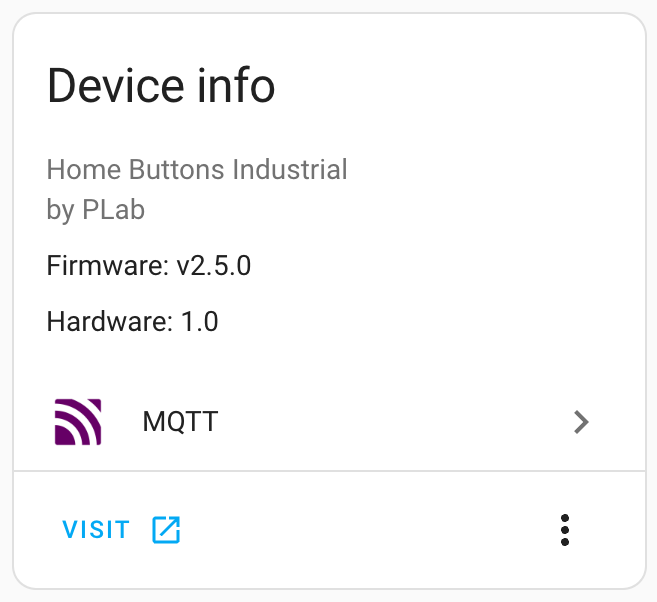
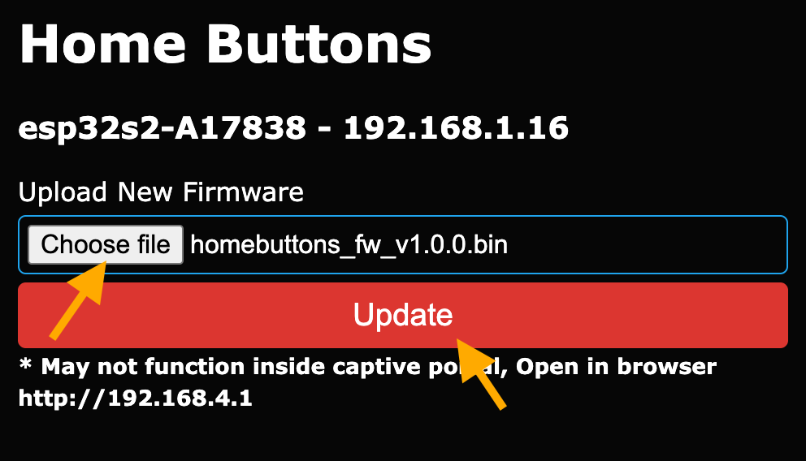
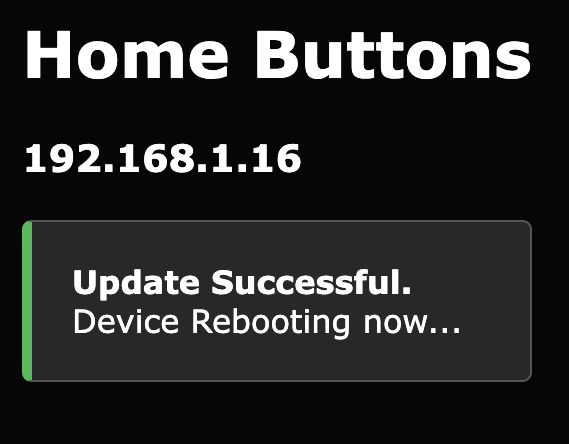
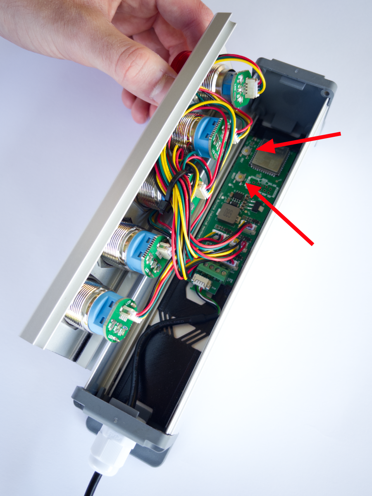

# Firmware Update

You can see the current firmware version in *Home Assistant*. 
Find your *Home Buttons* in the device list and click it. Firmware version is displayed in the *Device info* card.

{width="250"}

Firmware can be updated in a couple ways:

- [Over The Air](#OTA) (OTA) using a web interface - ***recommended***
- [Online Flash Tool](#online) using a web browser and USB
- [Esptool.py](#esptool) via USB
- [Full Image Flash](#full_image) - repair a device that is not booting. Can be done via Esptool.py or Online Flash Tool.

> OTA is the simplest way and therefore recommended.

## Over The Air (OTA) {#OTA}

1. Find the latest firmware [here](https://github.com/nplan/HomeButtons/releases){:target="_blank"}. Check release notes for any special update requirements. Make sure to select the correct file ending with `_industrial.bin`. Download it to your computer.

2. Enter setup by going to the [*Settings Menu*](#settings) and pressing the :red_circle: red button. 

    Navigate to the setup page via the web browser at `http://HB-XXXXXX.local`. Please see the label on the device for the exact address.

    {width="250"}

3. Click `Info` and scroll to the bottom of the *Info* screen. Click `Update`. The update menu will load:

    {width="250"}

4. Click `Choose file` and select the previously downloaded *.bin* file on your computer.

5. Click `Update` Wait a few seconds while the firmware is downloaded to the device. When done, `Update Successful` message will appear in your web browser and *Home Buttons* will reboot.

    {width="200"}
 
## Online Flash Tool {#online}

Flash your device from your web browser.

1. Connect *Home Buttons* to your computer using the USB-C cable.

2. Go to [nplan.github.io/HomeButtonsFlasher](https://nplan.github.io/HomeButtonsFlasher/) and follow the instructions.

> Google Chrome and Microsoft Edge are supported

## Esptool.py {#esptool}

1. Install ***esptool***. If you already have *Python* installed, the easiest way is to install it using *pip*: 

    ``` { .shell .copy }
    pip install esptool
    ```

    > See [here](https://docs.espressif.com/projects/esptool/en/latest/esp32/installation.html){:target="_blank"}
    for more installation details.

2. Find the latest firmware [here](https://github.com/nplan/HomeButtons/releases){:target="_blank"}. Check release notes for any special update requirements. Make sure to select the correct file:

    1. **Update image** - regular update

        Select file ending with `_industrial.bin`.

    2. **Full image** - to flash the entire device memory. This will erase all user data.

        Select file ending with `_industrial_full_image.bin`. 

    Download the file to your computer.

3. Open the case. See instructions [here](user_guide.md#opening_case){:target="_blank"}.

4. Place device into **programming mode**. Press and hold the `BOOT` button and then press the `RST` button.
`BOOT LED` will light up. Release both buttons.

    {width="350"}

5. Connect *Home Buttons* to your computer using the USB-C cable.

6. Determine port on you computer.

    ***Windows***
    
    Open *Device Manager* and check *Ports* section. 
    If you're not sure which device is *Home Buttons*, disconnect it and then reconnect it. 
    See which port disappears and then appears again. Remember the *COM##* name.

    ***macOS and Linux***

    Run the following command twice. First with *Home Buttons* connected and then disconnected.
    The port that is present the first time and not the second is the correct one.

    *macOS*

    ``` { .shell .copy }
    ls /dev/cu*
    ```    

    *Linux*

    ``` { .shell .copy }
    ls /dev/tty*
    ```

    Copy the path of the correct port.
 
7. Flash the firmware using *esptool*.

    Run this commands in *Terminal* or *Command Prompt*:

    1. **Update image** - regular update

        ``` { .shell .copy }
        python -m esptool --port PORT --after no_reset erase_region 0xe000 0x2000
        ```
        ``` { .shell .copy }
        python -m esptool --port PORT --after no_reset write_flash 0x10000 BIN_FILE_PATH
        ```

        Substitute `PORT` with port that you determined in previous step.
        Substitute `BIN_FILE_PATH` with the path of downloaded firmware *.bin* file.

        > The `erase_region` command resets the app partition boot switch. It's required to make sure the device will boot to the newly flashed firmware.

    2. **Full image** - to flash the entire device memory. This will erase all user data.

        ``` { .shell .copy }
        python -m esptool --port PORT --after no_reset write_flash 0x0 BIN_FILE_PATH
        ```

        Substitute `PORT` with port that you determined in previous step.
        Substitute `BIN_FILE_PATH` with the path of downloaded firmware *.bin* file.

8. Wait a few seconds for firmware to flash. When done, you will see a confirmation in *Terminal* or *Command Prompt* window.

9. Disconnect USB-C cable and press the `RST` button.

## Full Image Flash {#full_image}

This method flashes the entire device memory. It can be used to repair a device that is not booting.

**Important!** User data will be lost. This includes button labels, WiFi credentials, MQTT settings, etc.

You can flash your device via:

- *Online Flash Tool* - follow the instructions [above](#online). Select `Full Image` in the online tool prior to flashing.
- *Esptool.py* - follow the instructions [above](#esptool). Download the correct image when required.
